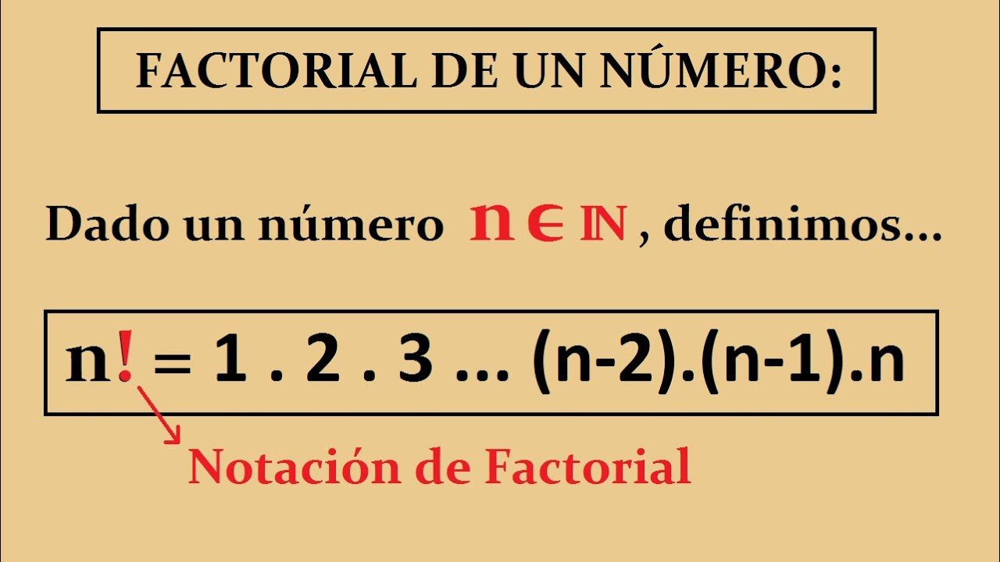
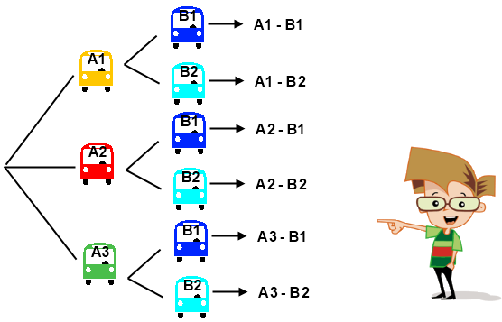
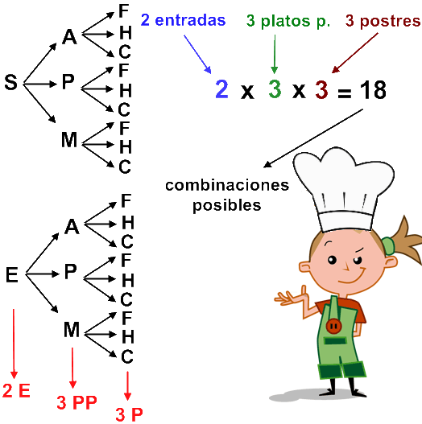

# 📘 Guía Accesible de Probabilidad — Versión 2

Aplicación de escritorio desarrollada en Python para reforzar el aprendizaje de **factorial, permutaciones y combinaciones**. Integra contenido teórico, ejercicios, cálculos interactivos, procesamiento por lotes y recursos de accesibilidad en una interfaz gráfica creada con Tkinter.

---

## 📌 Descripción general

La aplicación ayuda a comprender problemas de análisis combinatorio y a resolverlos de forma guiada. El usuario puede estudiar los conceptos, calcular operaciones individuales, procesar archivos con múltiples ejercicios y exportar los resultados para revisarlos en una hoja de cálculo.

La versión 2 presenta una interfaz moderna, estructura modular, validación de datos y una instalación simplificada desde la terminal.

---

## 🎯 Objetivos

### Objetivo general

Facilitar el aprendizaje de los fundamentos del análisis combinatorio mediante una aplicación de escritorio accesible e interactiva.

### Objetivos específicos

- Explicar factorial, permutaciones y combinaciones con ejemplos.
- Calcular operaciones validando los valores de entrada.
- Procesar ejercicios almacenados en archivos de texto.
- Exportar resultados en formato CSV.
- Ofrecer lectura por voz y ajuste del tamaño de fuente.
- Mantener una estructura de código clara y comprobable.

---

## ✨ Funcionalidades

### 🧮 Calculadora combinatoria

- Permutaciones: `P(n, r) = n! / (n-r)!`
- Combinaciones: `C(n, r) = n! / (r! · (n-r)!)`
- Validación de `n ≥ 0` y `0 ≤ r ≤ n`.
- Mensajes de error comprensibles para entradas inválidas.

### 📂 Procesamiento de archivos

- Lee operaciones en formato TXT.
- Acepta líneas vacías, espacios y comentarios iniciados con `#`.
- Identifica la línea exacta cuando el archivo contiene un error.
- Exporta el resultado a CSV, compatible con Excel y LibreOffice.

### ♿ Accesibilidad y recursos

- Lectura del contenido mediante texto a voz.
- Aumento y reducción del tamaño de letra.
- Temas claro, oscuro y de sistema; además de un modo de alto contraste.
- Atajos: `Ctrl + Enter` para calcular, `Ctrl + R` para leer y `Ctrl + S` para procesar un archivo.
- Imágenes, videos locales y reproductor opcional de música.
- La guía sigue disponible si el equipo no cuenta con salida de audio.

---

## 🖼 Recursos visuales de la guía

| Factorial | Permutaciones | Combinaciones |
| --- | --- | --- |
|  |  |  |

---

## 🏗 Arquitectura del proyecto

```text
guia-accesible-probabilidad-v2/
│
├── src/
│   └── guia_probabilidad/
│       ├── app.py          # Interfaz gráfica y accesibilidad
│       ├── calculos.py     # Validación y operaciones matemáticas
│       ├── archivos.py     # Lectura de TXT y exportación de CSV
│       ├── contenido.py    # Lecciones, ejemplos y bibliografía
│       ├── voz.py          # Lectura de contenido en segundo plano
│       ├── recursos/       # Imágenes y videos de la guía
│       └── __main__.py     # Ejecución como módulo
│
├── tests/                  # Pruebas automatizadas
├── scripts/
│   └── build_windows.ps1   # Creación del ejecutable de Windows
├── pyproject.toml          # Configuración del paquete instalable
└── README.md
```

---

## 🛠 Tecnologías utilizadas

- Python 3.10+
- Tkinter
- Pillow
- pygame
- pyttsx3
- unittest
- PyInstaller (opcional, para generar el `.exe`)

---

## 🚀 Instalación y ejecución

### Requisitos previos

- Python 3.10 o superior.
- `tkinter` instalado. En Windows y macOS normalmente viene incluido con Python.

### 1. Clonar el repositorio

```bash
git clone https://github.com/aledash3/guia-accesible-probabilidad-v2.git
cd guia-accesible-probabilidad-v2
```

### 2. Instalar la aplicación

```bash
python -m pip install .
```

### 3. Abrir la guía

```bash
guia-probabilidad
```

También puede ejecutarse como módulo:

```bash
python -m guia_probabilidad
```

---

## 📦 Crear un ejecutable de Windows

Para obtener una aplicación que pueda abrirse sin escribir comandos de Python:

```powershell
./scripts/build_windows.ps1
```

El archivo resultante estará en:

```text
dist/GuiaProbabilidad/GuiaProbabilidad.exe
```

---

## 📝 Formato del archivo de cálculos

Cada línea representa una operación:

```text
# Operación,n,r
P,6,5
C,6,5
```

- `P`: permutación; el orden importa.
- `C`: combinación; el orden no importa.

---

## 🧪 Pruebas

Ejecuta las pruebas de la lógica matemática y el procesamiento de archivos:

```bash
python -m unittest discover -s tests -v
```

Cada `push` y cada Pull Request ejecutan estas pruebas mediante GitHub Actions.

---

## 📚 Referencias

- Devore, J. L. *Probabilidad y Estadística para Ingeniería y Ciencias*.
- Walpole, R. E. y Myers, R. H. *Probabilidad y Estadística para Ingenieros*.
- Ross, S. M. *Introducción a la Probabilidad*.

---

## 👨‍💻 Autor

David Alejandro Cruz Palacios

Estudiante de Ingeniería en Ciencias de la Computación

Universidad Politécnica Salesiana — Quito, Ecuador

---

## 📄 Licencia

Este proyecto se distribuye bajo la [licencia MIT](LICENSE).
