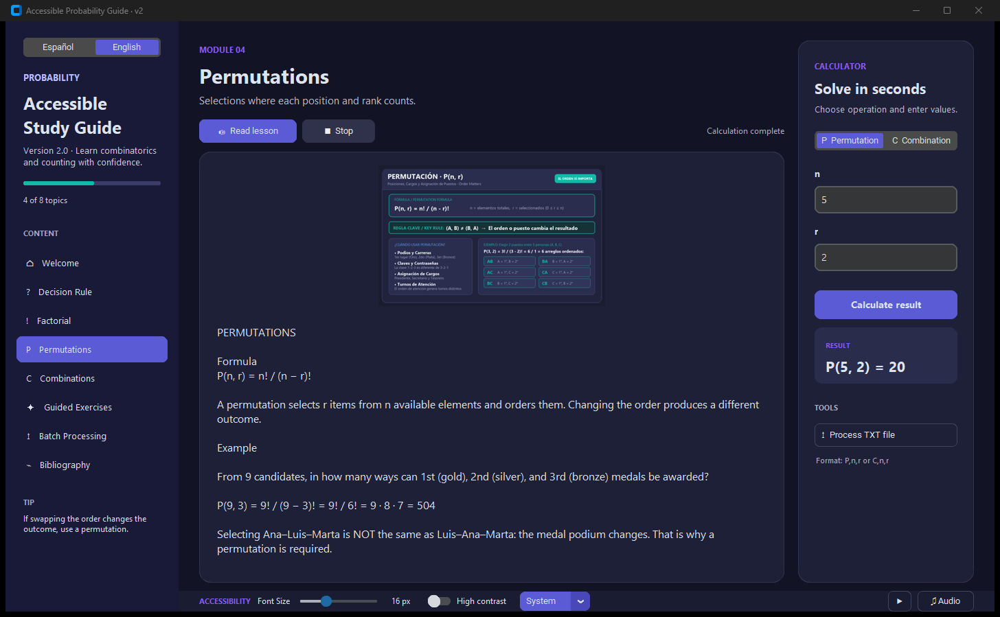
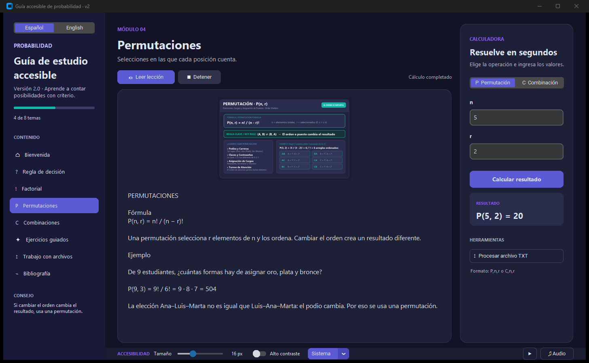
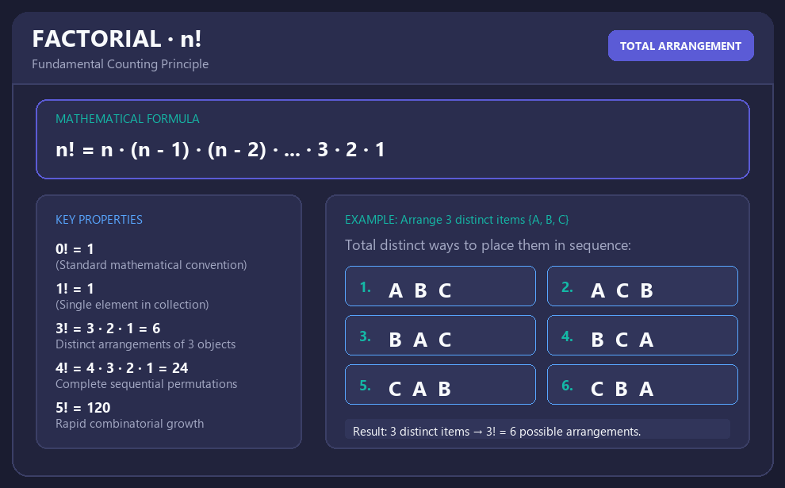
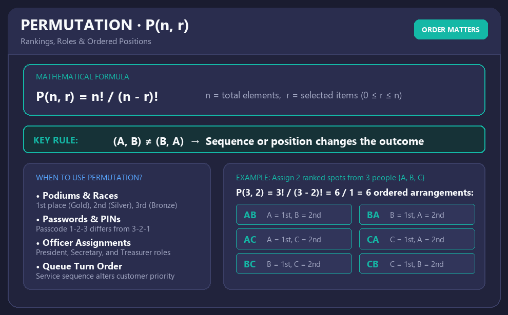
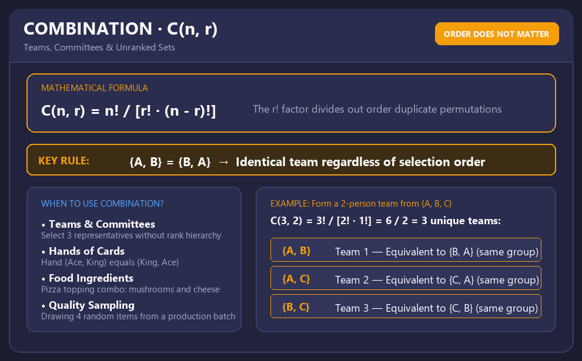

# 📘 Accessible Probability Guide

[](https://github.com/aledash3/accessible-probability-guide/actions)
[](https://www.python.org/)
[](https://customtkinter.tomschimansky.com/)
[](https://docs.pytest.org/)
[](LICENSE)
[](README.es.md)

An interactive, accessible desktop application built with Python for learning combinatorics and probability foundations (**factorials, permutations, and combinations**). It combines guided theoretical material, real-time interactive calculations, batch file processing, bilingual internationalization (English & Spanish), and robust accessibility features (Text-to-Speech synthesis, customizable UI contrast themes, dynamic font scaling, and keyboard shortcuts) within a modern desktop GUI.

> 🌐 **Language / Idioma:** English | [Leer documentación en Español](README.es.md)

---

## 📌 Overview

Understanding combinatorics and probability can be challenging without intuitive visual feedback and guided problem-solving tools. **Accessible Probability Guide** bridges this gap by providing an educational desktop software tailored for all learners, including users who rely on accessibility aids.

Users can study interactive lessons with visual demonstrations, calculate discrete combinatorics operations with strict mathematical domain validation, process batches of problems from external text files, and export structured CSV reports for spreadsheet analysis.

---

## 🖥️ Application Interface

Visual overview of the accessible desktop GUI featuring bilingual curriculum, text-to-speech controls, real-time combinatorics calculator, batch file processor, and accessibility preferences:

### English Interface
<p align="center">
  
</p>

### Spanish Interface
<p align="center">
  
</p>

---

## 🎯 Key Objectives

- **Guided Pedagogy:** Explain factorials, permutations, and combinations through clear definitions, mathematical properties, and visual aids.
- **Mathematical Domain Validation:** Enforce strict mathematical constraints ($n \ge 0$, $0 \le r \le n$) with friendly error messaging.
- **Batch Processing Engine:** Parse batch text files containing operations, handling comments, whitespace, and providing precise line-level error reporting.
- **Tabular Data Export:** Generate structured CSV reports compatible with Microsoft Excel, LibreOffice Calc, and data science workflows.
- **Universal Accessibility:** Implement asynchronous Text-to-Speech (TTS), on-the-fly font scaling, high-contrast visual themes, and complete keyboard navigation.
- **Production Architecture:** Follow clean separation of concerns, comprehensive unit testing, automated CI pipelines, and standalone Windows executable builds.

---

## ✨ Features

### 🧮 Combinatorics Calculation Engine
- **Permutations:** $P(n, r) = \frac{n!}{(n - r)!}$
- **Combinations:** $C(n, r) = \frac{n!}{r! \cdot (n - r)!}$
- **Factorials:** $n! = \prod_{k=1}^n k$ (with $0! = 1$)
- Comprehensive mathematical domain validation preventing invalid inputs and logical overflows.

### 📂 Batch Processing & CSV Export
- Fault-tolerant parser for plain text operation files (`sample_calculations.txt`).
- Full support for comments (`#`), trailing whitespace, and blank lines.
- Detailed error diagnostics pointing directly to the offending line number.
- One-click CSV export formatted for academic review or grading (`sample_export.csv`).

### ♿ Accessibility & Universal Design
- **Text-to-Speech (TTS):** Non-blocking background narration of educational lessons via `pyttsx3`.
- **Dynamic Typography Scaling:** Dedicated controls to enlarge or shrink font sizes across all views.
- **Theme Customization:** Light mode, Dark mode, and High-Contrast mode for low-vision environments.
- **Productivity Keyboard Shortcuts:**
  - `Ctrl + Enter`: Calculate current inputs.
  - `Ctrl + R`: Toggle TTS narration.
  - `Ctrl + S`: Open file dialog for batch calculation.
- **Hardware Resilience:** Graceful fallback ensures full functionality even on systems without audio output devices.

---

## 🖼 Educational Visuals

| Factorial | Permutations | Combinations |
| :---: | :---: | :---: |
|  |  |  |

---

## 🏗 Project Architecture

The codebase adheres to modern Python packaging standards (PEP 517/518) with a standard English package architecture:

```text
accessible-probability-guide/
├── .github/
│   └── workflows/
│       └── tests.yml            # GitHub Actions CI pipeline
├── scripts/
│   └── build_windows.ps1        # PyInstaller PowerShell packaging script
├── src/
│   └── probability_guide/
│       ├── __init__.py          # Package entry & version metadata
│       ├── __main__.py          # Module execution entrypoint
│       ├── app.py               # Tkinter GUI & accessibility controls
│       ├── calculations.py      # Combinatorics computation engine
│       ├── content.py           # Educational lessons & theoretical content
│       ├── file_processing.py   # Batch file parser & CSV exporter
│       ├── speech.py            # Background TTS audio synthesis worker
│       └── assets/              # Graphical and multimedia bundled assets
├── tests/
│   └── test_calculations.py     # Unit tests for calculations & parsing
├── sample_calculations.txt      # Sample batch input file
├── sample_export.csv            # Sample exported output CSV
├── pyproject.toml               # Build system, metadata & CLI entry points
├── LICENSE                      # MIT License
├── README.md                    # English technical documentation
└── README.es.md                 # Spanish educational documentation
```

---

## 🛠 Tech Stack

- **Core Language:** Python 3.10+
- **GUI Framework:** Tkinter & CustomTkinter
- **Image & Media Handling:** Pillow, pygame
- **Speech Synthesis:** pyttsx3 (SAPI5 / NSSpeechSynthesizer / espeak)
- **Packaging & Build Tools:** setuptools, PyInstaller
- **Testing & CI:** unittest, GitHub Actions

---

## 🚀 Installation & Usage

### Prerequisites
- Python 3.10 or higher.
- `tkinter` installed (bundled by default with standard Python installers on Windows and macOS).

### 1. Clone the Repository
```bash
git clone https://github.com/aledash3/accessible-probability-guide.git
cd accessible-probability-guide
```

### 2. Install the Package
```bash
python -m pip install .
```

### 3. Launch the Application
Run the globally registered console script:
```bash
probability-guide
```
*(Alternative alias: `guia-probabilidad`)*

Or execute directly as a Python module:
```bash
python -m probability_guide
```

---

## 📦 Windows Standalone Executable

To compile a self-contained `.exe` binary that runs on Windows without requiring a Python runtime:

```powershell
./scripts/build_windows.ps1
```

The compiled binary will be located in:
```text
dist/ProbabilityGuide/ProbabilityGuide.exe
```

---

## 📝 Batch Input File Format

The application parses batch calculations from simple text files (`sample_calculations.txt`):

```text
# Syntax: Operation, n, r
P, 6, 5
C, 6, 5
```
- `P`: Permutation ($P(n, r)$) — Element order matters.
- `C`: Combination ($C(n, r)$) — Element order does not matter.
- Lines starting with `#` or empty rows are automatically ignored.

---

## 🧪 Running Unit Tests

Run the test suite covering combinatorics calculations and file parsing routines:

```bash
python -m unittest discover -s tests -v
```

All tests are verified automatically on every push and pull request via GitHub Actions.

---

## 📚 Academic References

1. **Devore, J. L.** *Probability and Statistics for Engineering and the Sciences*. Cengage Learning.
2. **Walpole, R. E., Myers, R. H., Myers, S. L., & Ye, K.** *Probability & Statistics for Engineers & Scientists*. Pearson.
3. **Ross, S. M.** *Introduction to Probability and Statistics for Engineers and Scientists*. Academic Press.

---

## 👨‍💻 Author

**David Alejandro Cruz Palacios**  
Computer Science Engineering Student — Universidad Politécnica Salesiana  
GitHub: [@aledash3](https://github.com/aledash3)  
Course: Probability and Statistics (5th Semester)

---

## 📄 License

This project is licensed under the terms of the [MIT License](LICENSE).
